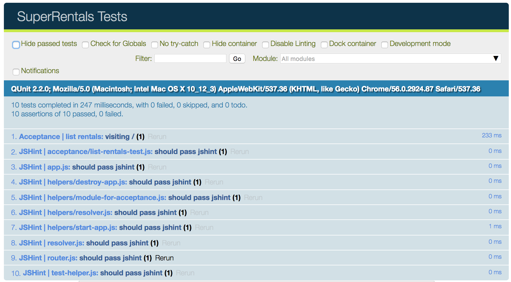

To demonstrate the basic setup and processing of an Ember application, this section will walk through building an Ember application for a property rental site called Super Rentals.
It will start with a homepage, an about page and a contact page.

Here's a look at the desired application before we get started.


Let's think through what we want to do on the home page of our Super Rentals application.

We want our application to:

* Show rentals as the home page
* Link to information about the company.
* Link to contact information.
* List the available rentals.
* Filter the list of rentals by city.
* Show more details for a selected rental

For the remainder of this page, we'll give you an introduction to testing in Ember and get you set up to add tests as we implement pieces of our app.
In subsequent tutorial pages, the final sections of each page will be dedicated to adding a test to the feature you just implemented.
These sections aren't required for a working application and you may move on with the tutorial without implementing them.

You may move on to the [next page](../routes-and-templates/), or continue reading about Ember testing.

### Testing Our Application As We Go

We can represent these goals as [Ember acceptance tests](../../testing/acceptance/).
Acceptance tests interact with our app like an actual person would, but are automated, ensuring that our app doesn't break in the future.

When you create a new Ember Project using Ember CLI, it uses the [`QUnit`](https://qunitjs.com/) JavaScript test framework to define and run tests.

We'll start by using Ember CLI to generate a new acceptance test:

```shell
ember g acceptance-test list-rentals
```

The command will generate the following output, showing that it created a single file called `tests/acceptance/list-rentals-test.js`.

```shell
installing acceptance-test
  create tests/acceptance/list-rentals-test.js
```

Opening the new test file will reveal some boilerplate code that will try to go to the `list-rentals` route and verify that the route is loaded.
This boilerplate code is there to guide you into your first working acceptance test.

Since we haven't added any functionality to our application yet, we'll use this first test to get bootstrapped on running
tests in our app.

To do this, replace occurrences of `/list-rentals` in the generated test with `/`.
The test will simply start our app at the base url, `http://localhost:4200/`,
and then do a basic check that the page finished loading and the the url is what we expect it to be.

```/tests/acceptance/list-rentals-test.js{-6,+7,-8,+9,-12,+13}
import { test } from 'qunit';
import moduleForAcceptance from 'super-rentals/tests/helpers/module-for-acceptance';

moduleForAcceptance('Acceptance | list-rentals');

test('visiting /list-rentals', function(assert) {
test('visiting /', function(assert) {
  visit('/list-rentals');
  visit('/');

  andThen(function() {
    assert.equal(currentURL(), '/list-rentals');
    assert.equal(currentURL(), '/');
  });
});
```

A few of things to note in this simple test:

* Acceptance tests are initialized by calling the function `moduleForAcceptance`.
  This function ensures that your ember application is started and shut down between each test.
* We define each test as a function and pass into the qunit `test` function.
* QUnit passes in an object called an [`assert`](https://api.qunitjs.com/category/assert/) to each test function.
  An `assert` has functions, such as `equal()`, that allow your test to check for conditions within the test environment.
  A test must have one passing assert to be successful.
* Ember acceptance tests use a set of implicit test helper functions,
  such as `visit`, `andThen`, and `currentURL` shown above.
  We'll dive more into these functions later in the tutorial.


Now run your test suite with the CLI command, `ember test --server`.

By default, when you run `ember test --server`, Ember CLI runs the [Testem test runner](https://github.com/testem/testem),
which in turn runs the qunit test framework on Chrome and [PhantomJS](http://phantomjs.org/) out of the box.

The launched Chrome web browser shows 10 successful tests.
Ember generates tests that lint each file you create using [JSHint](http://jshint.com/).
If you toggle the box labeled "Hide passed tests", you should see your successful acceptance test, along with 9 passing JSHint tests.



### Adding Your Application Goals as Acceptance Tests

As mentioned before, this test boilerplate is just for checking the environment, so now let's replace this test with our list of goals we described at the beginning of this section.

```/tests/acceptance/list-rentals-test.js
import { test } from 'qunit';
import moduleForAcceptance from 'super-rentals/tests/helpers/module-for-acceptance';

moduleForAcceptance('Acceptance | list-rentals');

test('should show rentals as the home page', function (assert) {
});

test('should link to information about the company.', function (assert) {
});

test('should link to contact information.', function (assert) {
});

test('should list available rentals.', function (assert) {
});

test('should filter the list of rentals by city.', function (assert) {
});

test('should show details for a selected rental', function (assert) {
});
```

Running `ember test --server` will show a total of 7 failed tests out of 15.
Each of the 6 tests defined above will fail, plus you'll notice one JSHint failure saying, `assert is defined but never used`.
The tests we defined fail because a QUnit test fails if it is empty.
Tests require a check for a specific condition (known as an `assert`).

As we walk through the tutorial, we'll use our acceptance tests as a checklist of functionality.
When all are green, we've accomplished our high level goals!
