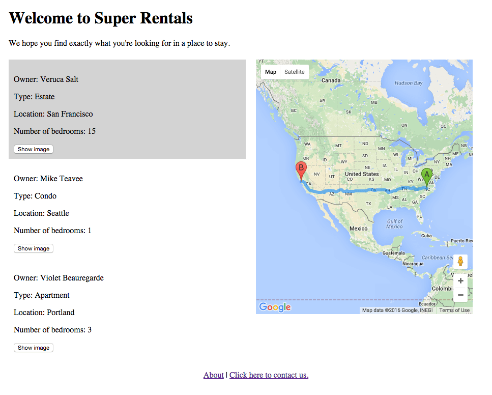

In Super Rentals, we want the ability to provide directions from where the renter is located to his or her various rental options.
To accomplish this, we need to make use of the browser's native geolocation API to determine our current location,
as well as interface with google's map and geocoding API to display directions.

To implement this feature, we are going to take advantage of several Ember concepts:

1. A component to display a google map with directions.
2. Utility functions to interface with Google APIs.
3. A service to keep track of the browser's current location.

### Making Google Maps Available in Ember

There are several ways to include 3rd party libraries in Ember. See the guides section on [managing dependencies](../../addons-and-dependencies/managing-dependencies/) as a starting point when you need to add one.

Since Google provides its map API as a remote script, we'll use curl to download it into our project's vendor directory.

```shell
curl -o vendor/gmaps.js https://maps.googleapis.com/maps/api/js?v=3.22
```
Once in the vendor directory, the script can be built into our app.
We'll just need to import it in our build file.

```ember-cli-build.js
/*jshint node:true*/
/* global require, module */
var EmberApp = require('ember-cli/lib/broccoli/ember-app');

module.exports = function(defaults) {
  var app = new EmberApp(defaults, {
    // Add options here
  });

  // Use `app.import` to add additional libraries to the generated
  // output files.
  //
  // If you need to use different assets in different
  // environments, specify an object as the first parameter. That
  // object's keys should be the environment name and the values
  // should be the asset to use in that environment.
  //
  // If the library that you are including contains AMD or ES6
  // modules that you would like to import into your application
  // please specify an object with the list of modules as keys
  // along with the exports of each module as its value.
  app.import('vendor/gmaps.js');

  return app.toTree();
};
```

### Loading Maps into Application Code

Now that the google map API library is built into our app, lets create a service to wrap them.
Services are used to package common concerns and keep shared state across the application

Accessing our maps API through a service will give us several benefits

* It is injected with a service locator pattern,
  meaning it will abstract the maps API from the code that uses it, allowing for easier refacoring and maintenance
* It is lazy-loaded, meaning it won't be initialized until its called the first time.
* It is a singleton, which could allow for potential caching of map data.
* It follows a lifecycle, meaning we have hooks to execute cleanup code when the app stopped.

Lets get started creating our service by generating it though Ember CLI.

```shell
ember g service maps
```
The service provides functions to create the map, geocode an address, and create/render directions.
Since the google api makes asynchronous calls for geoding and directions rendering,
the service will use Ember's promise API so that the caller can handle the response locally, instead of passing callbacks around.

```app/services/maps.js
import Ember from 'ember';

export default Ember.Service.extend({

  init() {
    this._super(...arguments);
    this.set('directionsService', new google.maps.DirectionsService());
    this.set('geocoder', new google.maps.Geocoder());
  },

  createMap(mapElement) {
    return new google.maps.Map(mapElement, { zoom: 10 });
  },

  createDirectionsRenderer(map) {
    return new google.maps.DirectionsRenderer({ map });
  },

  route(request) {
    return new Ember.RSVP.Promise((resolve, reject) => {
      this.get('directionsService').route(request, (response, status) => {
        if (status !== google.maps.DirectionsStatus.OK) {
          reject(status);
        } else {
          resolve(response);
        }
      });
    });
  },

  geocode(location) {
    return new Ember.RSVP.Promise((resolve, reject) => {
      this.get('geocoder').geocode({address: location}, (result, status) => {
        if (status !== google.maps.GeocoderStatus.OK) {
          reject(status);
        } else {
          resolve(result);
        }
      });
    });
  }
});

```

### Adding in Geolocation

We've just added a service that shows a map and additionally provides mapping data based on coordinates of two locations.
Additionally we can find coordinates based on an address.
Since we can get an address from the rental, we have half the directions in getting to a rental property.
How will the application know where the user is to complete the directions?
To accomplish this, we will use the geolocation API provided by the browser.

Since a user is possibly in motion is a long running task that needs to operate throughout the user's session, we will use an Ember service to keep the current location.

Lets start by using Ember CLI to generate our service.

```shell
ember g service geolocation
```

Now lets implement the service.
We start monitoring for geolocation changes as soon as the service is initialized.
When the geolocation API reports an update, the service sets the coordinates field.
Notice the service also clears the watch when the service is destroyed.

```app/services/geolocation.js
import Ember from 'ember';

const geolocation = navigator.geolocation;

export default Ember.Service.extend({
  coordinates: null,

  init() {
    this._super(...arguments);
    if (!this.get('geolocation')) {
      this.set('geolocation', geolocation);
    }
    this._monitorPosition();
  },

  willDestroy() {
    this._super(...arguments);
    this.get('geolocation').clearWatch(this.get('watchId'));
  },

  _monitorPosition() {
    this._clearWatch();
    this.get('geolocation').watchPosition((position) => {
      this.set('coordinates', position.coords);
    }, (error) => {
      Ember.Logger.log('geolocation unavailable');
    });
  }

});

```

### Displaying Maps

Now that we have a service that provides map functionality and another service that provides the user's current lcoation,
we can now create a component that uses the two coordinates and a map to display it all onscreen to the user.
It will take advantage of Ember's lifecycle hooks to lay out the map and update the directions when new rentals are selected or when the user's location changes.

The component should be invoked as follows:  

```template.hbs
{{google-map startCoords=geolocation.position destCoords=selectedCoords class="google-map"}}
```

```app/components/google-map.js
import Ember from 'ember';

export default Ember.Component.extend({
  maps: Ember.inject.service(),

  didInsertElement() {
    this._super(...arguments);
    const map = this.get('maps').createMap(this.$('.map').get(0));
    const directionsDisplay = this.get('maps').createDirectionsRenderer(map);
    Ember.run.scheduleOnce('afterRender', () => {
      this.set('map', map);
      this.set('directionsDisplay', directionsDisplay);
    });
  },

  didUpdateAttrs() {
    this._super(...arguments);
    if (this.get('startCoords') &&
        this.get('destCoords.longitude') &&
        this.get('destCoords.latitude')) {
      this.get('maps').route({
        destination: {
          lat: this.get('destCoords.latitude')(),
          lng: this.get('destCoords.longitude')()
        },
        origin: {
          lat: this.get('startCoords.latitude'),
          lng: this.get('startCoords.longitude')
        },
        travelMode: google.maps.TravelMode.DRIVING
      }).then((response) => {
        this.get('directionsDisplay').setDirections(response);
      }).catch((e) => Ember.Logger.error(e));
    } else {
      this.get('map').setCenter({
        lat: this.get('startCoords.latitude'),
        lng: this.get('startCoords.longitude')
      });
    }
  }
});
```

Note the CSS class is provided to give the map div some width and height, otherwise you won't see it.

### Tying Map Display to Rental Selection

Now that we have a map service, a geolocation service,
we can tie it all together by creating an action to handle clicking of a rental.
Clicking a rental should geocode the address of the rental and make the coordinates available to the map component in the template.
We'll define the action in our controller, as well as inject the geolocation service.

```app/controller/index.js
import Ember from 'ember';

export default Ember.Controller.extend({
  geolocation: Ember.inject.service(),
  maps: Ember.inject.service(),

  selectedCoords: Ember.K,

  actions: {
    select(unit) {
      this.set('selectedUnit', unit);
      this.get('maps').geocode(unit.get('city')).then((result) => {
        this.set('selectedCoords', {
          latitude: result[0].geometry.location.lat,
          longitude: result[0].geometry.location.lng
        });
      }).catch((e)=> {
        Ember.Logger.error('error geocoding: ', e);
      });
    }
  }
});
  
```

In our index template, we add our map component, passing in the start coordinates from the geolocation service, and the selected coordinates we set from clicking the rental.
We also add our action to the click event on our rental listing component, and add the rental model object as a parameter.

```app/templates/index.js
<div class="rentalBanner">
  <h1> Welcome to Super Rentals </h1>

  We hope you find exactly what you're looking for in a place to stay.
</div>
<div class="rentalContainer">
  <div class="rentalList">
    <ul>
      {{#each model as |rentalUnit|}}
        {{rental-listing rental=rentalUnit
          selectedUnit=selectedUnit
          click=(action "select" rentalUnit)}}
      {{/each}}
    </ul>
  </div>
  <div class="rentalMap">
   {{google-map startCoords=geolocation.coordinates
     destCoords=selectedCoords
     class="google-map"}}
  </div>
</div>
<div class="rentalFooter">
  {{#link-to "about"}}About{{/link-to}} |
  {{#link-to "contact"}}Click here to contact us.{{/link-to}}
</div>

```

Now when a user selects a rental, the map will be reloaded to show the directions from where they are to the rental they are looking at.  You can add on to this funtionality by adding additional functions to the maps service to enable display of things like written directions and drive time.

Here's what the code we put together above looks like with some CSS added to show item selection and place the map on a pane beside the rental selection.


